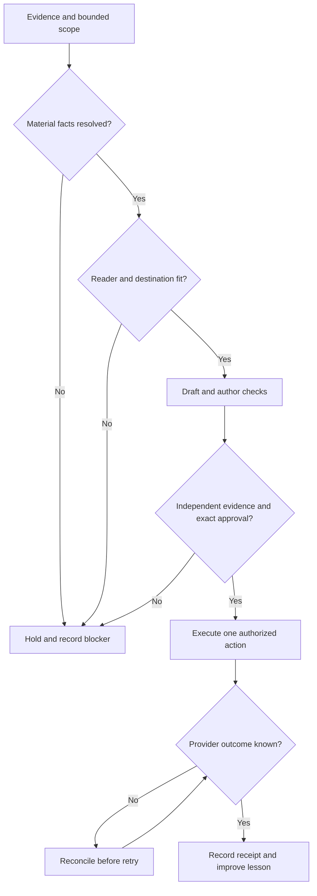

# Evidence-to-publication operating procedure

- **Document ID:** TOS-DOC-RUNBOOK-0001
- **Version:** 0.1.0 proposal
- **Truth state:** proposed
- **Control owner / adoption authority:** Patrick Craven
- **Work item:** [TOS #40](https://github.com/peteywee/topshelf-operating-system/issues/40)

This proposed SOP describes required behavior for an evidence-backed publication workflow. It does not assert that the controls are implemented, that the workflow has passed a live pilot, or that this document is adopted. Independent review and Patrick's adoption decision are outstanding. Nothing here grants an agent publication, merge, deployment, spending, account-management or policy-change authority.

## Purpose and scope

Convert real project work into useful public lessons while preserving the chain from source evidence to exact approved content to a reconciled external result. The reader should understand what happened, what was learned, and what remains uncertain without needing to accept the author's confidence as proof.

Separate the temporary project that builds or changes a publication pipeline from the recurring operation that uses it. A release can finish while the operation remains unproven. A scheduled review can exist while its output quality and submission process remain unproven.

The first reference workload is Build Notes with blog articles, XQueue adaptations and Reddit discussion drafts. The procedure is provider-neutral. Provider schemas, permissions, rate limits, schedules, community rules and deployment APIs remain workload/adapter details. It does not implement the TOS execution kernel, make TSAL runtime middleware, or replace a workload's own safety controls.

## Governing concerns and applicability

| Concern | TOS reference | Workload obligation |
|---|---|---|
| Authority, canonical truth, change scope | CTR-004, CTR-005, CTR-012, CTR-023 | Identify exact actor, action, target, scope and authoritative source before work |
| Release and recovery | CTR-029, CTR-030, CTR-049 | Tie a release to an immutable candidate, recoverable baseline, exact approval and observed outcome |
| Lessons, evidence and rejection behavior | CTR-032, CTR-069, CTR-070, CTR-071, CTR-072 | Preserve original failures; make material gates reject deliberate bad inputs |
| Privacy, secrets and external claims | CTR-060, CTR-062, CTR-083, CTR-084 | Classify before disclosure; every public claim has bounded evidence and owner authority |
| Review separation | CTR-093 | An implementer may submit evidence but cannot independently verify or approve that implementation |
| Brand | CTR-053 | Use the current approved brand source and check its exact assets/tokens and permitted variation |

These are mappings to existing concern definitions, not declarations that their draft templates have been instantiated or promoted. Each workload must resolve required, conditional and not-applicable controls with reasons. Unknown material applicability blocks the affected external action.

## Responsibilities

| Function | May do | Must not do |
|---|---|---|
| Planner / review coordinator | Select evidence, classify gaps, prepare a bounded work order and next content decision | Invent activity, silently broaden scope or grant publishing capability |
| Worker / author | Implement the approved slice, draft content, run author checks, submit an immutable candidate | Treat its checks as independent verification; change authority to obtain a pass |
| Independent reviewer / verifier | Inspect requirements and candidate, reproduce evidence, challenge negative controls, record findings | Materially author the candidate being independently reviewed; rewrite findings as owner approval |
| Owner / promoter | Patrick approves the exact action and content, adopts procedures, accepts explicitly stated residual risk | Infer an unrelated approval from possession of credentials or a previous release |
| Publishing workload / operator | Execute one already-authorized action and record the provider outcome | Expand targets, start a second publishing authority or blindly retry ambiguous results |

A separate session or agent is independent only if its actual authoring/review history supports that claim. Changing role labels within the same author does not create independence. If reviewer capability is unavailable, prepare the complete handoff and hold promotion; do not silently waive the gate. Existing applicable owner approval persists and is not requested again merely because work resumed.

## Entry packet

Before implementation or public submission, record:

- durable issue/work order, objective, included/excluded files or systems, acceptance criteria and stop conditions;
- source-of-truth locations and current candidate/ref; relevant open work and freshness conflicts;
- implementer, verifier and owner identities; bounded authority and any owner-reserved action;
- repair budget and time/cost bounds; no unbounded retries or new scheduler;
- release baseline and recovery procedure, including data implications;
- evidence references needed for public claims, private review and independent reproduction.

An unreachable reference is missing evidence. Conversation history and retrieved memories are leads, not substitutes for current repository or provider state when those facts matter. Source documents supplied by the owner remain authoritative within their stated scope.

## Procedure

### 1. Reconcile before selecting

Read prior packets, content IDs, approval history and publication receipts. Separate unpublished, approved, submitted-but-unknown, visible, removed, deferred and failed records. A missing receipt is not proof nothing was posted. Resolve uncertainty before another attempt.

Choose the next useful, unused lesson. A scheduled review must return a decision even when it produces no new post: draft, revise, reply-only or hold, with reason. Do not fill a calendar with invented progress or duplicate introductions.

### 2. Build the evidence ledger

For each candidate claim, record project, source, source date, exact candidate/version where relevant, observed statement, classification, what could invalidate it and permitted public wording. Use the workload's explicit equivalents of:

- BUILT AND VERIFIED;
- BUILT BUT NOT FULLY VERIFIED;
- ATTEMPTED/FAILED;
- DECIDED/PLANNED;
- UNKNOWN.

Historical evidence remains historical. A build proves its measured build result; a provider deployment receipt proves the identified deployment state; a visible page proves only the observed page; none automatically proves customer value, recoverability, security or business results.

### 3. Teach the failure and its correction

Draft with BUILD → FAIL → DIAGNOSE → LEARN → REBUILD → VERIFY → EXPLAIN. Include the real problem, attempted design, surprise/failure, root cause, professional concept in plain language, corrected or proposed design, positive/negative evidence, reusable macro lesson, project-specific micro lesson and next bounded experiment.

Proposed remedies must remain described as proposed. A failed experiment is publishable evidence when the failure itself is supported; it must not be rewritten into a success story. Never invent identity details, credentials, customers, revenue, users, tests or deployments.

### 4. Tailor to the actual reader and destination

For every platform, name the reader problem, suitable format, useful standalone takeaway, exact destination and policy review state. A social mention, share composer or profile link is not a distribution plan or a publication receipt.

For Reddit, select one community, inspect current rules, AI-writing policy, flair, self-promotion/link conditions and account eligibility. If any required check is inaccessible or incompatible, hold that submission. Do not disguise generated writing where it is prohibited. Do not cross-post the same lesson as a broadcast campaign. A relevant link-free post is valid; backlinks are optional and must serve the reader.

Preparatory answers to likely questions may be drafted when clearly labeled hypothetical. A reply intended for submission must refer to a real inspected comment and pass the same content and destination checks. No fabricated engagement, automated comments, messages, follows, votes or moderator contact is authorized by this SOP.

### 5. Bind exact approval and run controls

Approval binds the complete rendered payload: title/body/thread, claims, target account/community, platform, date/timezone, media, optional links and any material rendering settings. Record the exact fingerprint and attribution. Changing any bound field invalidates that approval; retain the old revision and approval history.

For Site changes, bind the candidate, built archive, target Site/audience and scope. Reuse a known saved version only when source and artifact still match. Do not copy an earlier pass onto a new candidate. Source commits, runtime artifacts and evidence commits must remain separately identifiable to avoid circular evidence anchors.

Check privacy, public/private route separation, links, brand rules, canonical source format, operator permissions, one publishing authority and applicable failure paths. Independent verification must reproduce or explicitly delimit each critical claim. Local preflight tools assist this process; they do not authenticate a human approval from a JSON name, replace provider permissions or prove a TOS kernel exists.

### 6. Publish once, reconcile and verify

Only the already-authorized operator executes the exact action. If a promoted article is needed for an adaptation, release and verify its public canonical URL first. Private previews and unpublished/unverified links must not enter public distribution records.

Wait for the identified provider operation's terminal state. Preserve request identity, immutable payload identity, provider receipt, actual target/account and observed result. An unknown timeout result enters reconciliation; it is not a retry instruction. Use the workload's deterministic missed-item policy. For the reference X campaign, missed posts are deferred to its tail without changing IDs or creating another scheduler.

### 7. Close the loop

Record the exact outcome and limitations, useful questions, corrections and the next bounded experiment. Compare actual packets across review cycles before claiming the recurring operation works. Record audience/referral/conversion metrics only from inspected sources; missing analytics remains unknown.

Propose a reusable lesson control separately. Adoption requires the applicable change-control, independent review and owner decision. A lesson that appears in an SOP is documented; it becomes demonstrated control only after implementation and negative verification.

## Decision tree

## Required negative controls

| Injected fault | Required result |
|---|---|
| Author presented as independent verifier | Promotion rejected; real author retained in evidence |
| Missing approval, wrong candidate/archive/target/audience | Promotion held; no provider mutation |
| Text, community, account, media, URL or date changed after approval | Fingerprint mismatch; revised content returns to review |
| Internal strategy, credentials or review ledger exposed in a public route/archive | Release held; affected artifact removed and rechecked |
| Draft/template/control configuration labeled operationally proven | Claim rejected until named behavior and evidence exist |
| Builder or installer exits unsuccessfully | Nonzero result preserved; no later PASS or terminal shutdown caused by global shell settings |
| Ambiguous provider result or duplicate request | Reconciliation required; no blind repost/redeploy |
| New authority competes with existing live publisher | Execution blocked until one authority is established |
| Current rules/eligibility unavailable | Affected community submission remains draft/held |
| Governed document or dependencies change after verified anchor | Existing freshness mechanism invalidates stale evidence; no report-only bypass |

Use isolated synthetic fixtures for destructive/side-effect cases. Never test duplicate publication by posting real duplicates. Each implementation records which controls are automatic, procedural, unimplemented or not applicable. Passing a fixture is not a production incident receipt.

## Failure, repair and recovery

Classify a failure before repair. Repair only within the work order's remaining budget and original scope/policy. Preserve failed output and candidate identity. Rebuild and reverify changed candidates. Budget exhaustion, ambiguous provider state, stale source, missing independent evidence, unsafe disclosure or authority mismatch stops the affected action.

Recovery uses an identified last-known-good artifact/configuration and the applicable owner authority. Reverting presentation does not undo social posts or database changes; identify compensating actions and data implications separately. A rollback needs its own observed terminal outcome. Do not delete a failed record or rewrite a denial as a pass.

## Acceptance and adoption

This proposal is review-ready when its registry entry is proposed, references resolve, no existing verified anchor is weakened, author findings are recorded and an independent review handoff names the exact candidate. Adoption additionally requires independent findings, Patrick's decision and the normal controlled promotion path.

The reference operation is demonstrated only after two consecutive usable two-day packets, one authorized platform-appropriate pilot with a reconciled receipt, and a feedback-to-lesson update. This pilot condition does not authorize either Reddit or X publishing by itself. Keep recurring cadence and submission frequency in workload configuration, not universal policy.

Before changing a governed document to verified, follow [the existing freshness procedure](session-bootstrap-and-document-freshness.md): verify document/dependencies at commit A, then record that immutable anchor in a subsequent registry commit. Preserve ancestry or reverify after squash/rebase. Proposed documents must not carry fabricated verified anchors.

## Reference implementation boundary

Build Notes has a Site, drafts and review configuration. Its local release-check code and author-run negative tests provide limited implementation evidence. No statement here certifies that Site, a Reddit pilot, a healthy XQueue live runtime, independent review completion, automatic publication enforcement or full TOS onboarding. Open TOS architecture proposals (#39 and #30) must be reconciled if adopted; they are not silently treated as merged authority by this SOP.
